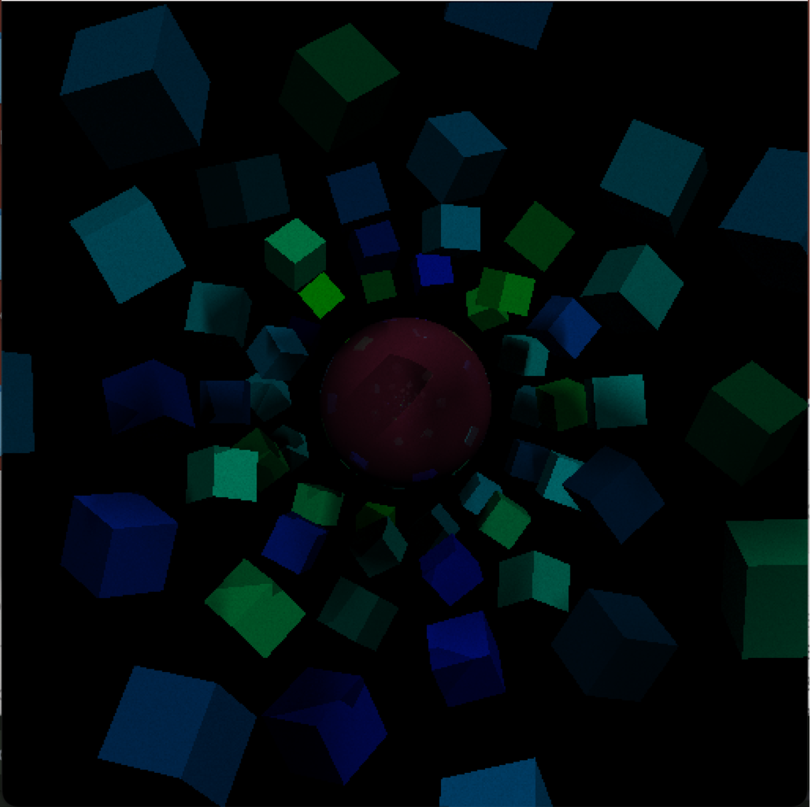

# Path Tracing

### Code by Yuvraj Baweja and Shobhit Gupta

For this project we did path tracing, using our original ray tracing code.

We implemented the Cook-Torrance BRDF model, Russian Roulette path tracing, and rectangular area lights.

All of the scenes that test features can be found in pathTracer.

## Scenes 
The scenes we demonstrate are:

1. A scene displaying different roughness, metallicness, etc. based on the Cook-Torrance BRDF model.
- assets/pathTracer/spheres.json
- The scene below demonstrates increasing metallicness and roughness from the bottom left being the least rough and metallic and increasing in metallic as the spheres go further away and increasing in roughness as the spheres are further to the right.
- 
- Below is the Whitted version (our best attempt at making the scene similar)
- 
2. The same scene as above but with a directional light so everything has even lighting
- assets/pathTracer/spheresDirectional.json
- 
3. A scene showcasing softer shadows with area lights.
- assets/pathTracer/spheres.json (OLD SCENE)
- 
4. Taking an old scene and using an area light while changing the center spheres metallic and roughness parameters
- assets/pathTracer/hitchcockbrdf.json
- 
5. A pure metallic object that has a low roughness
- assets/pathTracer/singleSphere.json with a cubemap
- 

## Code Navigation
The relevant code we changed is in lights.h/cpp, RayTracer.cpp, and material.h/cpp.

- RayTracer class
  - Shoot N=100 rays through each pixel and average them
  - Added a tracePath function that handles path tracing
    - Trace path first checks if we should russian roulette terminate with a q probability of termination of 0.1
    - If the ray survives, we shoot our bounce ray to get the color of the indirect light and then divide by the pdf
    - Using the indirect light, we get the color contribution of this ray by calling the Cook-Torrance BRDF function we made
    - Depending on the roughness of the material, we implemented a really simple importance sampling that has a smoothness chance of shooting a reflection ray and average it
    - To complete the Russian Roulette termination factor, since this ray survived, we divide it's color contribution by the probability of surviving (0.9)
- Material class
  - Added roughness and metallic parameters
  - Added a shadeBRDF function that uses the GGX normal distribution, the GGX geometry function, and the Schlick Fresnel function on every light source to get the color of the object
    - These are divided into helper functions that are called for every light source including the indirect light
- Light class
  - Added rectangular area lights
    - Defined by a corner, two basis vectors, and two basis lengths
    - Fires N shadow rays randomly into the area light then averages the result to create shoft shadows
    - N is currently set to 10 but higher values of N create better soft shadows
    - Shadow attenuates and distance attenuates the same as a point light